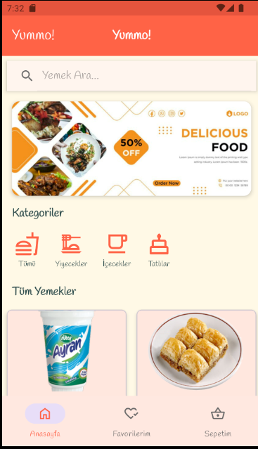

# 🍦 Yummo! - Yemek Sipariş Uygulaması (Bootcamp Bitirme Projesi) 🚀

<!-- 📸 BURAYA UYGULAMANIN GENEL BİR EKRAN GÖRÜNTÜSÜNÜ KOYABİLİRSİNİZ (Örn: Anasayfa) -->
 

## 📝 Proje Künyesi

*   **👩‍💻 Geliştirici:** Fatımanur Kantar
*   **🎓 Bootcamp:** [Pupilica Android Geliştirme Bootcamp]
*   **👨‍🏫 Eğitmen:** Kasım Adalan
*   **🗓️ Proje Teslim Tarihi:** 30 Mayıs 2025
*   **🔗 GitHub Repository:** [https://github.com/Fatmanurkntr/AndroidBitirmeProjesi.git](https://github.com/Fatmanurkntr/AndroidBitirmeProjesi.git)

## 🎯 Uygulamanın Amacı ve Kapsamı

Bu proje, bir mobil yemek sipariş uygulamasının temel işlevlerini ve modern Android geliştirme pratiklerini uygulamayı hedeflemiştir. Kullanıcılar, sanal bir restorandan yemek seçimi yapabilir, sepetlerini yönetebilir ve sipariş sürecini deneyimleyebilirler.

## 🛠️ Kullanılan Teknolojiler ve Kütüphaneler

*   **🌐 Programlama Dili:** Kotlin
*   **🏛️ Mimari Desen:** MVVM (Model-View-ViewModel)
*   **⚡ Asenkron İşlemler:** Kotlin Coroutines
*   **💉 Bağımlılık Enjeksiyonu:** Hilt
*   **📡 Ağ İstekleri:** Retrofit & Gson
*   **🖼️ Görsel Yükleme:** Glide
*   **🧭 Navigasyon:** Android Navigation Component (Safe Args ile)
*   **🎨 UI Bileşenleri:** Material Design Components, RecyclerView, CardView, BottomNavigationView, SearchView, Snackbar
*   **💾 Yerel Veritabanı:** Room Persistence Library (Favoriler ve Sipariş Geçmişi için)
*   **📦 Yerel Veri Saklama:** SharedPreferences (Adres için)
*   **🔗 ViewBinding**
*   **🔄 Yaşam Döngüsü Bileşenleri:** ViewModel, LiveData

## ✨ Uygulama Özellikleri ve İşlevleri

###  الأساسية Temel İşlevler (PDF Gereksinimleri)

1.  **🍔 Yemekleri Listeleme (Anasayfa):**
    *   Uzak API'den çekilen yemekler; resimleri, adları ve fiyatlarıyla listelenir.
   

2.  **📄 Yemek Detayını Görme:**
    *   Yemeğe tıklandığında detay sayfası açılır (büyük resim, ad, fiyat).
    
3.  **🔢 Detayda Adet Seçebilme:**
    
4.  **➕ Sepete Ekleme:**
    *   Anasayfadan hızlı ekleme veya detay sayfasından seçilen adetle ekleme.
    *   `Snackbar` ile kullanıcıya geri bildirim.

5.  **🛒 Sepetteki Yemekleri Görüntüleme:**
    *   "Sepetim" sayfasında eklenen ürünler, detayları ve toplam tutar gösterilir.
    *   Gönderim ücreti ve genel toplam dinamik olarak hesaplanır.

6.  **🗑️ Sepetten Yemek Silme:**
    *   Sepetten ürün çıkarma ve tutarların anında güncellenmesi.

### 🌟 Eklenen Ekstra Özellikler

1.  **❤️ Favori Yemekler Sistemi:**
    *   Kalp ikonuna tıklayarak yemekleri favorilere ekleme/çıkarma.
    *   Favori durumu Room veritabanında saklanır.
    *   Ayrı "Favorilerim" sayfasında listeleme.

2.  **🌙 Karanlık Mod (Dark Mode) Desteği:**
    *   Cihazın sistem temasına otomatik uyum.
    *   Karanlık mod için özel renk paleti.

3.  **👤 Kullanıcı Profili ve Sipariş Geçmişi:**
    *   "Profilim" sayfası.
    *   **📍 Teslimat Adresi:** Kullanıcı adresini kaydetme, görüntüleme ve güncelleme (`SharedPreferences`).
    *   **🧾 Sipariş Geçmişi:** "Sepeti Onayla" sonrası siparişlerin Room veritabanına kaydı ve listelenmesi. Sipariş detaylarını görme ve geçmişi temizleme.

4.  **🍽️ Kategoriye Göre Basit Filtreleme (Anasayfa):**
    *   Anasayfada "Yiyecekler", "İçecekler", "Tatlılar", "Tümü" kategorileri.
    *   Tıklandığında yemek listesinin istemci tarafında filtrelenmesi.

5.  **🚚 Gönderim Ücreti Mantığı (Sepet Sayfası):**
    *   500 TL üzeri siparişlerde bedava gönderim, altında 50 TL ücret.
    *   Kullanıcıyı bilgilendiren dinamik mesaj.

6.  **💬 Snackbar ile Geri Bildirimler:**
    *   `Toast` yerine daha modern `Snackbar` kullanımı.

7.  **🎨 Modernleştirilmiş UI Tasarımı ve Tipografi:**
    *   "Handjet" fontu ile özgün bir görsel kimlik.
    *   Kullanıcı deneyimini iyileştiren renk paleti ve yerleşim düzeni.

## 🏗️ Mimari Yaklaşım (MVVM)

Proje, **MVVM (Model-View-ViewModel)** mimari desenine uygun olarak geliştirilmiştir:

*   **Ⓜ️ Model:** Data class'lar, API Service, Retrofit Client, Room Entity/DAO/Database, Repository.
*   **💻 View:** Activity, Fragment'lar, Adapter'lar, Layout XML'leri.
*   **🧠 ViewModel:** Her Fragment için ayrı ViewModel, Repository ile iletişim, LiveData ile veri sunumu.

## 💡 Öğrenilenler ve Karşılaşılan Zorluklar

*   Bu proje; Kotlin, MVVM, Hilt, Room, Retrofit, Navigation Component ve Coroutine'ler gibi modern Android teknolojilerini etkin kullanma becerimi geliştirdi.
*   `LiveData` transformasyonları (`map`, `switchMap`, `MediatorLiveData`) ve Room ilişkileri önemli öğrenme alanlarıydı.
*   İstemci tarafı filtreleme ve API kısıtlamalarıyla başa çıkma yöntemleri üzerine çalışıldı.
*   Tutarlı ve kullanıcı dostu bir UI/UX tasarımı oluşturmanın önemi kavrandı.

## 🚀 Gelecekteki Olası Geliştirmeler

*   Gerçek backend ile sipariş ve ödeme entegrasyonu.
*   Kullanıcı girişi.
*   Gelişmiş filtreleme ve sıralama.
*   Yemeklere puan/yorum özelliği.
*   Teslimat takibi.
*   Push bildirimleri.
*   Kapsamlı testler.

